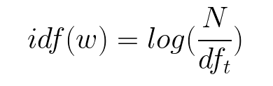

# [WildFire](https://insight-wildfire.appspot.com/)

*Connecting vendors with the right buyer.*

### What is WildFire?

Public institutions in Canada spend an estimated $22 billion dollars a year on the buying of goods and services from vendors. A critical problem is that buyers don't know which vendors to select for a given project. Part of this problem stems from the fact that the current system is inefficient due to:

(1) Projects being classified under predefined categories that are too general.
(2) Vendors don't have any recommendations based on project content.  

Vendors need a better way to see the projects they bid on. A potential solution for this is to use Natural Language Processing to create a better content-based taxonomy for projects and to provide recommendations. 

### Using WildFire

Users can select to find a project and be presented with a unique project description. The model then provides keywords related to the project as well as a list of top recommender projects. Users can click each project for more information about the project. 

### How it Works

### Input and Preprocessing

Thousands of project descriptions are first preprocessed. The text information is preprocesed to remove a number of irrelevant features, such as special characters and stop words that do not convey import information with respect to the project content. The descriptions are then:

Tokenized: Given a character sequence and a defined document unit, tokenization is the task of chopping it up into pieces, called tokens 

Lemmatized:  Lemmatization usually refers to doing things properly with the use of a vocabulary and morphological analysis of words, normally aiming to remove inflectional endings only and to return the base or dictionary form of a word, which is known as the lemma. For example, the lemmatized version of leaves is 'leaf'.

Vectorized: TF-IDF stands for “Term Frequency — Inverse Data Frequency”. First, we will learn what this term means mathematically.

Term Frequency (tf): gives us the frequency of the word in each document in the corpus. It is the ratio of number of times the word appears in a document compared to the total number of words in that document.

Inverse Data Frequency (idf): used to calculate the weight of rare words across all documents in the corpus. 

Combining these two we come up with the TF-IDF score (w) for a word in a document in the corpus. It is the product of tf and idf:

### Topic Modelling with Latent Dirilecht Allocation

To create a structure that dynamically reflects specific project content, topic modelling can be used. Specifically, Latent Dirilect Allocation (LDA) is a NLP technique that can extract relevant topics from a corpus of documents in an unsupervised manner. Description of LDA 

α is the per-document topic distributions,
β is the per-topic word distribution,
θ is the topic distribution for document m,
φ is the word distribution for topic k,
z is the topic for the n-th word in document m, and
w is the specific word

In the plate model diagram above, you can see that w is grayed out. This is because it is the only observable variable in the system while the others are latent. Because of this, to tweak the model there are a few things you can mess with and below I focus on two.
α is a matrix where each row is a document and each column represents a topic. A value in row i and column j represents how likely document i contains topic j. A symmetric distribution would mean that each topic is evenly distributed throughout the document while an asymmetric distribution favors certain topics over others. This affects the starting point of the model and can be used when you have a rough idea of how the topics are distributed to improve results.

Taking a closer look at some of the visualized topics that have been extracted from the project discription, we can see that one of these topics is related to construction/renovation related content. Each topic is associated with a number of words as well as their probability of occurence within that designated topic.

Similarly, another topic conveys information related to projects describing medical/scientific equipment. 

The topics appear to be mapping on to real content that has been extracted from the project descriptions. However, we can take this a step further and ask ourselves if these topics are indeed valid. One way this can be determined is by looking at the categorical labels or each project description and identify the most frequent categories within each topic.

We can see below that for the "construction" topic, the most frequently occurring categorical label is "Building and facility maintenance and repair services". For the "medical/lab" topic, the most frequent categories are "Measuring and observing testing instruments" "Laboratory and scientific equipment" and "Medical diagnostic imaging and nuclear medicine products".

